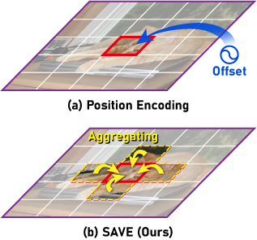

# SAVE: Encoding Spatial Interactions for Vision Transformers

Spatial Aggregation Vector Encoding (SAVE) is a method for establishing spatial information for vectors (elements of input tokens, queries, keys, or values) in vision transformers. It can be plug-and-play in vectors, even with other position encoding methods. It aggregates part of surrounding vectors with spatial contextual connections by establishing two-dimensional relationships.This repository contains pytorch supported code and configuration of the proposed aggregation encoding for vision transformers:



## Classification
This implementation is based on the [Deit](https://github.com/facebookresearch/deit) backbone.

```
# An example for training on 8 GPUs:
python -m torch.distributed.launch --nproc_per_node=8 --use_env main.py --model save_deit_t16_224 --batch-size 64
```

To modify the SAVE configurations, go to `models.py`.

## Visualization for one anchor

We provide an example in this section

First, assign `“extension”` to `Mode` and `True` to `ABS`. Then, do:

```
python models.py
```

Print the Gaussian kernel of Vertical Extension mode at a specific position:

```bash
[[ 0.   0.   0.   0.   0.   0.   0.   0.   0.   0.   0.   0.   0.   0. ]
 [ 0.   0.   0.   0.   0.6  0.   0.   0.   0.   0.   0.   0.   0.   0. ]
 [ 0.   0.   0.   0.   0.8  0.   0.   0.   0.   0.   0.   0.   0.   0. ]
 [ 0.   0.   0.   0.   0.9  0.   0.   0.   0.   0.   0.   0.   0.   0. ]
 [ 0.   0.6  0.8  0.9 -1.   0.9  0.8  0.6  0.   0.   0.   0.   0.   0. ]
 [ 0.   0.   0.   0.   0.9  0.   0.   0.   0.   0.   0.   0.   0.   0. ]
 [ 0.   0.   0.   0.   0.8  0.   0.   0.   0.   0.   0.   0.   0.   0. ]
 [ 0.   0.   0.   0.   0.6  0.   0.   0.   0.   0.   0.   0.   0.   0. ]
 [ 0.   0.   0.   0.   0.   0.   0.   0.   0.   0.   0.   0.   0.   0. ]
 [ 0.   0.   0.   0.   0.   0.   0.   0.   0.   0.   0.   0.   0.   0. ]
 [ 0.   0.   0.   0.   0.   0.   0.   0.   0.   0.   0.   0.   0.   0. ]
 [ 0.   0.   0.   0.   0.   0.   0.   0.   0.   0.   0.   0.   0.   0. ]
 [ 0.   0.   0.   0.   0.   0.   0.   0.   0.   0.   0.   0.   0.   0. ]
 [ 0.   0.   0.   0.   0.   0.   0.   0.   0.   0.   0.   0.   0.   0. ]]
```
where the `-1.` indicates the anchor, and the others are kept to one decimal place. 

## Citing
- TO DO
