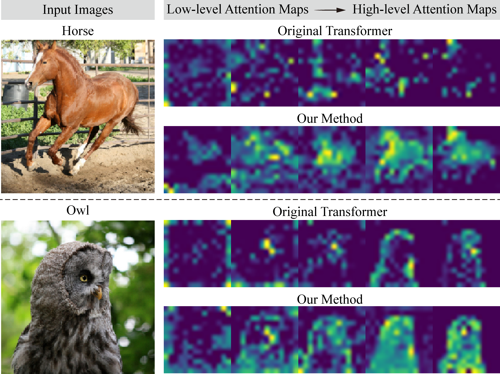
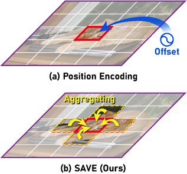
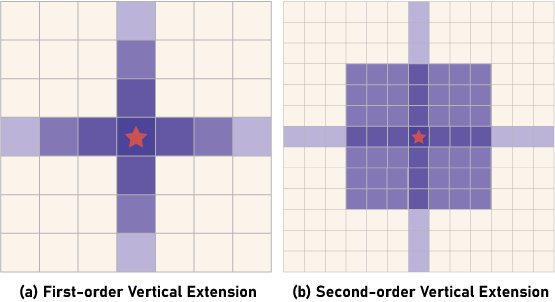
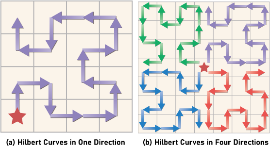

# SAVE: Encoding Spatial Interactions for Vision Transformers

Spatial Aggregation Vector Encoding (SAVE) is a method for establishing spatial information for vectors (elements of input tokens, queries, keys, or values) in vision transformers. It can be plug-and-play in vectors, even with other position encoding methods. It aggregates part of surrounding vectors with spatial contextual connections by establishing two-dimensional relationships.This repository contains pytorch supported code and configuration of the proposed aggregation encoding for vision transformers:

<p align="left">
  
  
</p>

## Vertical Extension Mode

The vertical extension mode with an anchor vector (marked as a red pentagram). Consider all vectors that extend in the same row and column centered on the anchor vector. Lighter colors indicate greater distance. (a) The aggregation is applied once to the vectors with the top, bottom, left, and right directions. (b) The vectors with the four vertical directions are superimposed twice for aggregation.



### Training with Extension Mode
This implementation is based on the [Deit](https://github.com/facebookresearch/deit) backbone.

```
# An example for training on 8 GPUs:
python -m torch.distributed.launch --nproc_per_node=8 --use_env main.py \
--batch-size=64 \
--data-set=IMNET \
--model=save_deit_t16_224 \
--save-vectors=qkv \
--save-mode=extension \
--save-param=base
```

### Visualization for one anchor of extention mode
We provide an example in this section

```
python models\attention_save.py
```

Print the Gaussian kernel of Vertical Extension mode at a specific position:

```bash
[[ 0.   0.   0.   0.   0.   0.   0.   0.   0.   0.   0.   0.   0.   0. ]
 [ 0.   0.   0.   0.   0.   0.   0.   0.   0.   0.   0.6  0.   0.   0. ]
 [ 0.   0.   0.   0.   0.   0.   0.   0.   0.   0.   0.8  0.   0.   0. ]
 [ 0.   0.   0.   0.   0.   0.   0.   0.   0.   0.   0.9  0.   0.   0. ]
 [ 0.   0.   0.   0.   0.   0.   0.   0.6  0.8  0.9 -1.   0.9  0.8  0.6]
 [ 0.   0.   0.   0.   0.   0.   0.   0.   0.   0.   0.9  0.   0.   0. ]
 [ 0.   0.   0.   0.   0.   0.   0.   0.   0.   0.   0.8  0.   0.   0. ]
 [ 0.   0.   0.   0.   0.   0.   0.   0.   0.   0.   0.6  0.   0.   0. ]
 [ 0.   0.   0.   0.   0.   0.   0.   0.   0.   0.   0.   0.   0.   0. ]
 [ 0.   0.   0.   0.   0.   0.   0.   0.   0.   0.   0.   0.   0.   0. ]
 [ 0.   0.   0.   0.   0.   0.   0.   0.   0.   0.   0.   0.   0.   0. ]
 [ 0.   0.   0.   0.   0.   0.   0.   0.   0.   0.   0.   0.   0.   0. ]
 [ 0.   0.   0.   0.   0.   0.   0.   0.   0.   0.   0.   0.   0.   0. ]
 [ 0.   0.   0.   0.   0.   0.   0.   0.   0.   0.   0.   0.   0.   0. ]]
```
where the `-1.` indicates the anchor, and the others are kept to one decimal place. 

## Hilbert Curves Mode

The Hilbert curve mode with an anchor vector (marked as a red pentagram). The arrows start and end by connecting two adjacent vectors in order. (a) Sequential representation of the vectors for one anchor aggregated in a single region. (b) Representation of vectors of four regions aggregated by one anchor.



### Training with Hilbert Mode

```
# An example for training on 8 GPUs:
python -m torch.distributed.launch --nproc_per_node=8 --use_env main.py \
--batch-size=64 \
--data-set=IMNET \
--model=save_deit_t16_224 \
--save-vectors=qkv \
--save-mode=hilbert \
--save-param=base
```

## Citing
If this project is help for you, please cite it.
```
@article{ma2024save,
  title={SAVE: Encoding spatial interactions for vision transformers},
  author={Ma, Xiao and Zhang, Zetian and Yu, Rong and Ji, Zexuan and Li, Mingchao and Zhang, Yuhan and Chen, Qiang},
  journal={Image and Vision Computing},
  pages={105312},
  year={2024},
  publisher={Elsevier}
}
```
